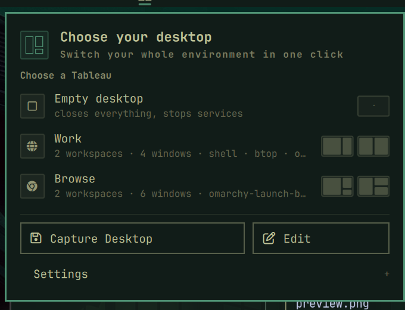

# Tableau



## Leave a desktop. Return to it instantly.

Tableau turns your whole Omarchy desk into a choice in the bar. Your workspaces,
windows, terminals, applications, services, and layout come back together — so
switching from coding to browsing feels like changing rooms, not rebuilding a
desk.

### The first minute

1. Install Tableau and open it from the bar.
2. Choose **Work** or **Browse** to try a ready-made desk.
3. Arrange anything you like, then choose **Capture Current Desktop**.

That is the entire learning curve. Your own tableaus appear beside the starters,
ready for one-click switching.

## Why people keep it installed

- **Keep context**: return to the same coding desk, terminals, and services.
- **Change mode**: move to a clean research and file-management environment.
- **Capture the good state**: save the desktop you already have without writing
  configuration.
- **Stay in control**: Tableau asks before recovery and never silently restores
  a desktop after a restart.

On a clean install, `Work` and `Browse` are available immediately; no setup
command is required. The cards are previews of the desk each choice builds, and
the highlighted card always means “currently loaded” — not merely “keyboard
focus”.

A tableau can open:

- workspaces
- terminal sessions
- applications
- background services

Choose a Tableau from the bar. Tableau closes the current desktop, then opens
the new one. Nothing starts automatically at login.

## The bar menu

- **Empty desktop** closes all windows and stops services started by Tableau.
- **Saved tableaus** load a desktop layout.
- **Capture Current Desktop** saves the windows that are open now.
- **Rename**, **Duplicate**, and **Delete** manage saved tableaus.
- **Edit** opens the configuration file.

Keyboard controls:

- `j` / `k` or Up / Down: move
- Enter or Space: activate
- `r`: refresh
- `x`: delete the selected tableau
- Escape: close the menu

Open the centered Tableau switcher at any time with `SUPER + ALT + T`.

## Configuration

The file is:

```text
~/.config/omarchy/tableau.toml
```

It is read each time the menu opens.

```toml
[options]
grace = 8

[[setups]]
name = "Work"
icon = ""
services = []

  [[setups.workspaces]]
  number = 1
  columns = [
    { width = 2, windows = [{ term = "" }] },
    { width = 1, windows = [{ term = "btop" }] },
  ]

  [[setups.workspaces]]
  number = 2
  columns = [
    { width = 1, windows = [{ app = "omarchy-launch-browser" }] },
    { width = 1, windows = [{ app = "nautilus" }] },
  ]
```

### Windows

| Key | Meaning |
| --- | --- |
| `term` | Open the configured terminal directly into a command. Use `""` for a shell prompt. |
| `app` | Run an application with its arguments. |
| `dir` | Working directory. |
| `class` | Window class, when it differs from the command. |
| `height` | Relative height inside a column. |
| `width` | Relative width of a column. |
| `float` | Keep the window floating. |
| `wait` | Seconds to wait for the window. Default: 20. |

Use the default Omarchy helpers when possible:

```toml
{ term = "" }
{ term = "btop" }
{ app = "omarchy-launch-browser" }
{ app = "nautilus" }
```

The built-in starter configuration uses these defaults, so it also works on a
fresh Omarchy install without optional developer applications.

### Monitors

Add `monitor` to a workspace to request a display:

```toml
  [[setups.workspaces]]
  number = 3
  monitor = "DP-2"
  columns = [{ width = 1, windows = [{ term = "" }] }]
```

If the display is not connected, Tableau uses the focused monitor.

### Services

Services can be systemd user units or background commands. Commands are parsed
as arguments and launched directly; shell operators and pipelines are not
interpreted.

```toml
services = [
  "docker-desktop",
  { run = "python -m http.server 8000", dir = "~/Work/project" },
]
```

Only services started by Tableau are stopped later. System services are not
supported. Review commands before loading a file from another source.

## Screens and layout

Tableau adapts layouts to the connected displays. It limits columns on narrow
screens and remembers an arrangement for each display setup.

Forget the remembered arrangement with:

```bash
omarchy-tableau forget
```

Tableau opens windows one at a time. A missing application is reported in the
menu. If a window refuses to close, Tableau pauses and asks what to do.

If a load is interrupted by a crash or shell restart, Tableau marks it as
recoverable and offers **Restore** and **Start clean** in the menu. It never
silently replaces the current desktop.

## CLI

```bash
omarchy-tableau status [--json]
omarchy-tableau load Work [--force]
omarchy-tableau capture "New tableau"
# `save` remains available as a compatibility alias.
omarchy-tableau save "New tableau"
omarchy-tableau rename "New tableau" "Renamed tableau"
omarchy-tableau duplicate Work "Work copy"
omarchy-tableau delete "Work copy"
omarchy-tableau init [--force]
omarchy-tableau edit
omarchy-tableau retry [--force]
omarchy-tableau clear
```

## Install

The fastest path is two commands:

```bash
omarchy plugin add https://github.com/novuon/omarchy_tableau.git --enable --yes
omarchy bar move novuon.tableau --section left
```

Then open the Tableau icon in the bar and choose **Work** or **Browse**. Both
starter tableaus are available immediately on a clean install, so you can try
the workflow before editing any configuration. When you have a desk worth
keeping, use **Capture Current Desktop** to save it.

Requirements: Omarchy with the standard `omarchy-shell` and Hyprland helpers.
Tableau uses the terminal and application launchers already provided by Omarchy;
there are no extra services or developer tools to install.

To remove Tableau safely:

```bash
omarchy plugin remove novuon.tableau --yes
```

Removing the plugin does not delete your `~/.config/omarchy/tableau.toml` file
or saved Tableau state. Reinstalling the plugin can therefore restore your
previous setup selection without changing your desktop automatically.

For local development:

```bash
omarchy plugin validate ~/.config/omarchy/plugins/novuon.tableau
omarchy-shell shell rescanPlugins
```

Run the checks with:

```bash
test/validate.sh
```
